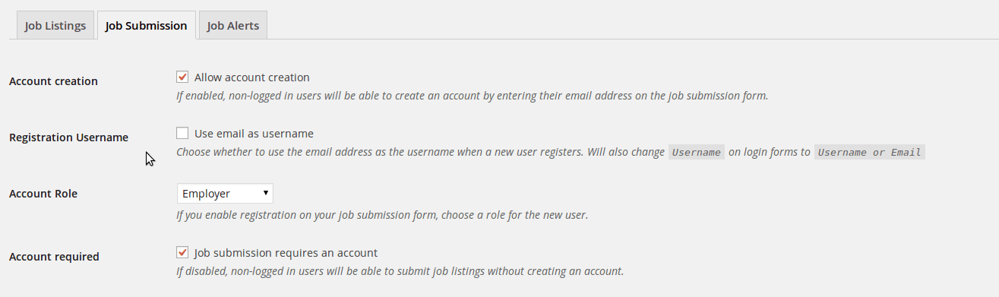

# WP Job Manager Registration Use Email #
+ **Contributors:** tripflex, fris
+ **Donate link:** http://gittip.com/tripflex
+ **Tags:** wp job manager, job manager, registration, email, user, jobify, job manager, login, login label, tripflex
+ **Requires at least:** 3.8
+ **Tested up to:** 4.3
+ **Stable tag:** 1.3.0

Use email address as username when a new user registers with WP Job Manager. Set custom label for `Username` on login pages. Compatible with Jobify (removes username from register form).
## Description ##

This plugin will use the email address as the username whenever someone registers through WP Job Manager.  This will also work with any other plugins or themes that use the `job_manager_create_account_data` filter.

With release of version 1.2.0 you can now change the default label "Username" for all login screens to use a customized user-defined label.

Version 1.3.0 of this plugin includes a new feature for WP Job Manager and Jobify theme that removes the "Username" field from the Registration Form

The Jobify theme has been confirmed and tested to work correctly with this plugin.

* note: * using email as username is disabled by default, you must enable it under the WP Job Manager settings page.  There is a link to the page when you activate this plugin.

### Features ###
* Use email as username
* Set display_name and nickname as username that was going to be used
* Replace "Username" with "Username or Email" on login forms
* Set custom user-defined label for "Username" on login pages
* Removes Username field from WP Job Manager and Jobify Theme Registration Forms

### Requires ###
* [WP Job Manager by Mike Jolley](http://mikejolley.com/projects/wp-job-manager/)

### Recommended ###
* [Jobify Wordpress Theme by Astoundify](http://themeforest.net/item/jobify-job-board-wordpress-theme/5247604?ref=tripflex)

### Documentation ###

Documentation will be maintained on the [GitHub Wiki here](https://github.com/tripflex/wp-job-manager-registration-use-email/wiki).

### Contributing and reporting bugs ###

You can contribute code and localizations to this plugin via GitHub: [https://github.com/tripflex/wp-job-manager-registration-use-email](https://github.com/tripflex/wp-job-manager-registration-use-email)

### Support ###

If you spot a bug, you can of course log it on [Github](https://github.com/tripflex/wp-job-manager-registration-use-email/issues)

Or contact me at myles@smyl.es

## Screenshots ##

Enable from WP Job Manager settings "Job Submission" tab

Login screen custom user-defined label preview

## Installation ##

Install directly from Wordpress installation.  Go to Plugins and then search for "WP Job Manager Registration Use Email"

* Manual Installation *
Extract the zip file and just drop the contents in the wp-content/plugins/ directory of your WordPress installation and then activate the Plugin from Plugins page.

* Usage *
1. Install and Activate
2. Go to "Job Listings > Settings > Job Submission" and select checkbox.

## Frequently Asked Questions ##

## Changelog ##

### 1.3.0 ###
*August 20, 2015*
NEW FEATURE: Username field removed from WP Job Manager and Jobify theme Registration Forms
Cleaned up entire codebase
Added PHP Doc blocks
Tested up to WordPress 4.3

### 1.2.0 ###
*May 7, 2014*
NEW FEATURE: Custom user-defined label to change "Username" on login pages

### 1.1.2 ###
*May 5, 2014*
Fix static notice issue, change add_option to update_option

### 1.1.1 ###
*May 5, 2014*
BUG FIX: User role dropdown being removed on settings page

### 1.1.0 ###
*May 3, 2014*
New Feature: Change "Username" to "Username or Email" on login forms
Update to semantic versioning
Added GitHub and Translation links to plugin page

### 1.0 ###
*April 19, 2014*
First Release
